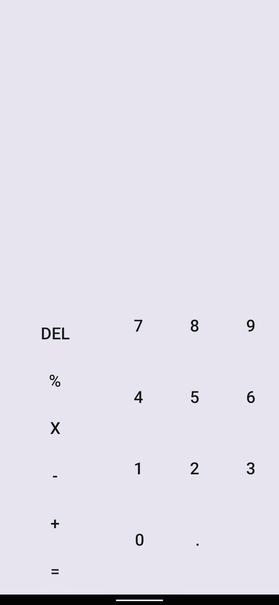

# Calculator

### just a simple calculator app

Layout Best Practices
---------------------

The code adheres to all of the following best practices:
- Text sizes are defined in sp
- Lengths are defined in dp
- Padding and margin is used appropriately, such that the views are not crammed up against each other.

Text Wrapping
--------------

Information displayed on list items is not crowded.

Rotation
--------

Upon device rotation:

- The layout remains scrollable.
- The app should save state and restore the list back to the previously scrolled position.
- The UI should adjust properly so that all contents of each list item is still visible and not truncated.
- The Search button should still remain visible on the screen after the device is rotated.

Code Readability
-----------------

Code is easy to follow, logically. Standards of indentation and formatting are followed, so that the code and its structure are clearly visible.

Naming conventions
------------------

All variables, methods, and resource IDs are descriptively named such that another developer reading the code can easily understand their function.

Format
------

The code is properly formatted i.e. there are no unnecessary blank lines; there are no unused variables or methods; there is no commented out code.
The code also has proper indentation when defining variables and methods.
